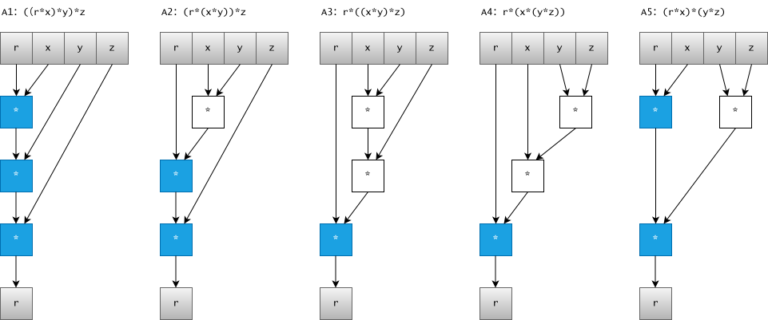
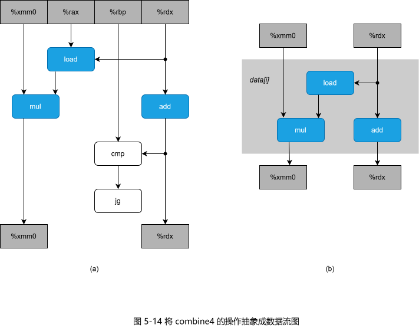
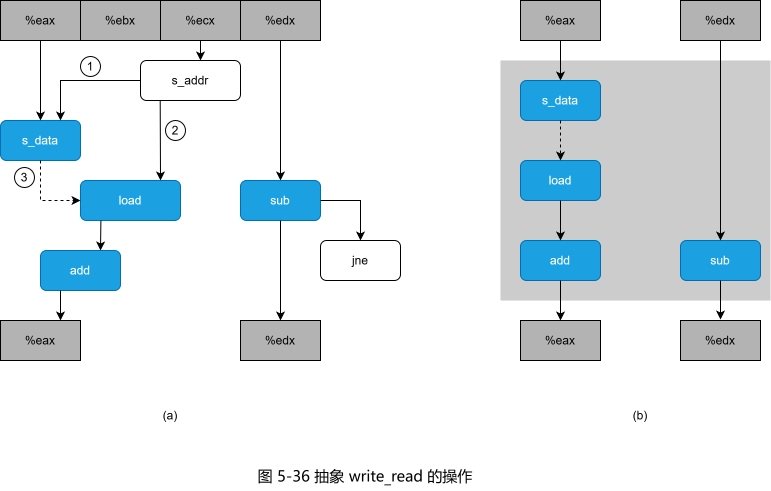
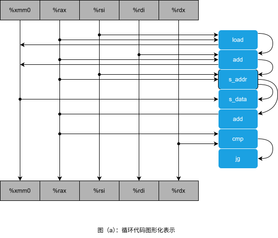
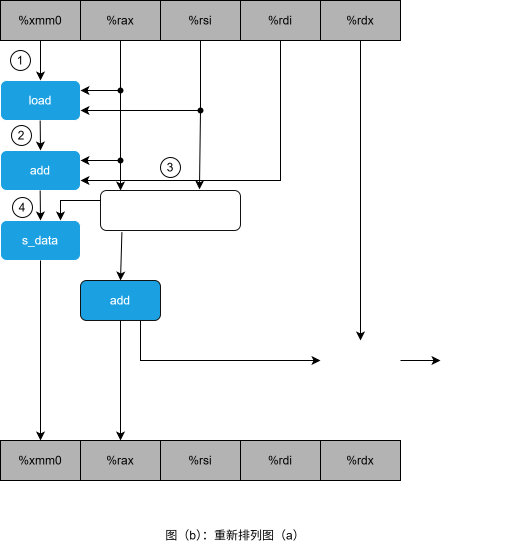
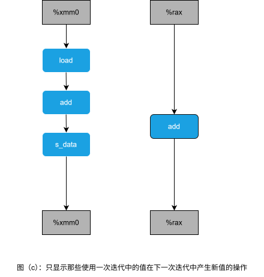
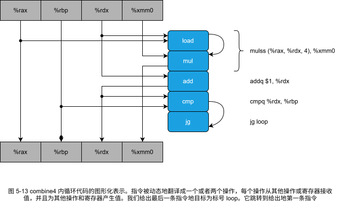
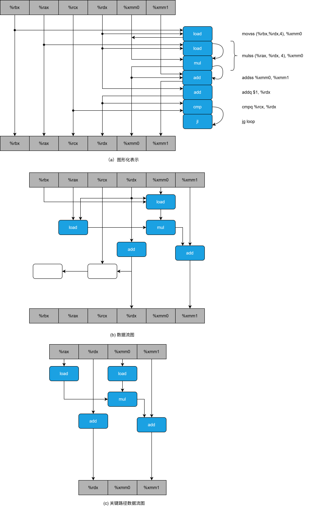

# 第5章 优化程序性能

## 练习题

### 练习题 5.1

下面的问题说明了存储器别名使用，可能会导致意想不到的程序行为的方式。
考虑下面这个交换两个值的过程：

```c
/* Swap value x at xp with value y at yp */
void swap(int *xp, int *yp)
{
    *xp = *xp + *yp; /* x + y */
    *yp = *xp - *yp; /* x + y - y = x */
    *xp = *xp - *yp; /* x + y - x = y */
}
```

如果调用这个过程时 xp 等于 yp，会有什么样的效果？

答案：此时 x 和 y 等于 0。

### 练习题 5.2

在本章后面，我们会从一个函数开始，生成许多不同变种，这些变种保持函数的行为，又具有不同的性能特性。
对于其中三个变种，我们发现运行时间（以时钟周期为单位）可以用下面的函数近似地估计：

* 版本 1：60 + 35n
* 版本 2：136 + 4n
* 版本 3：157 + 1.25n

每个版本在 n  取什么值时是三个版本中最快的？记住，n 总是整数。

答案：

* n 小于等于 2 时，版本 1 最快
* n 等于 2，且小于等于 7 时，版本 2 最快
* n 大于 7 时，版本 3 最快

### 练习题 5.3

考虑下面的函数：

```c
int min(int x, int y) { return x < y ? x : y; }
int max(int x, int y) { return x < y ? y : x; }
void incr(int *xp, int v) { *xp += v; }
int square(int x) { return x*x; }
```

下面三个代码片段调用这些函数：

A.

```c
for (i = min(x, y); i < max(x, y); incr(&i, 1))
    t += square(i);
```

B.

```c
for (i = max(x, y) - 1; i >= min(x, y); incr(&i, -1))
    t += square(i);
```

C.

```c
int low = min(x, y);
int high = max(x, y);

for (i = low; i < high; incr(&i, 1))
    t += square(i);
```

假设 x 等于 10，而 y 等于 100。
填写下表，指出代码片段 A~C 中 4 个函数每个被调用的次数：

|代码|min|max|incr|square|
|-|-|-|-|-|
|A.|||||
|B.|||||
|C.|||||

答案：

|代码|min|max|incr|square|
|-|-|-|-|-|
|A.|1|91|90|90|
|B.|91|1|90|90|
|C.|1|1|90|90|

### 练习题 5.4

当用带命令行选项 “-O2” 的 GCC 来编译 `combine3` 时，得到的代码 CPE 性能远好于使用 -O1 时的：

<table>
    <thead>
        <tr>
            <th rowspan="2">函数</th>
            <th rowspan="2">页码</th>
            <th rowspan="2">方法</th>
            <th colspan="2">整数</th>
            <th colspan="3">浮点数</th>
        </tr>
        <tr>
            <th>+</th>
            <th>*</th>
            <th>+</th>
            <th>F*</th>
            <th>D*</th>
        </tr>
    </thead>
    <tbody>
        <tr>
            <td>combine3</td>
            <td>336</td>
            <td>用 -O1 编译</td>
            <td>6.01</td>
            <td>8.01</td>
            <td>10.01</td>
            <td>11.01</td>
            <td>12.02</td>
        </tr>
        <tr>
            <td>combine3</td>
            <td>336</td>
            <td>用 -O2 编译</td>
            <td>3.00</td>
            <td>3.00</td>
            <td>3.00</td>
            <td>4.02</td>
            <td>5.03</td>
        </tr>
        <tr>
            <td>combine4</td>
            <td>338</td>
            <td>累积在临时变量中</td>
            <td>2.00</td>
            <td>3.00</td>
            <td>3.00</td>
            <td>4.00</td>
            <td>5.00</td>
        </tr>
    </tbody>
</table>

由此得到的性能与 `combine4` 相当，不过对应整数求和的情况除外，虽然性能已经得到了显著的提高，但是还低于 `combine4`。
在检查编译器产生的汇编代码时，我们发现对内循环的一个有趣的变化：

```x86asm
    combine3: data_t = float, OP = *, compiled -O2
    i in %rdx, data in %rax, limit in %rbp, dest at %rx12
    Product in %xmm0
1     .L560:                        loop:
2       mulss (%rax,%rdx,4), %xmm0      Multiply product by data[i]
3       addq $1, %rdx                   Increment i
4       cmpq %rdx, %rbp                 Compare limit:i
5       movss %xmm0, (%r12)             Store product at dest
6       jg .L560                        If >, goto loop
```

把上面的代码与用优化等级 1 产生的代码进行比较：

```x86asm
    combine3: data_t = float, OP = *, compiled -O1
    i in %rdx, data in %rax, dest in %rbp
1     .L498:                        loop:
2       movss (%rbp), %xmm0             Read product from dest
3       mulss (%rax,%rdx,4), %xmm0      Multiply product by data[i]
4       movss %xmm0, (%rbp)             Store product at dest
5       addq $1, %rdx                   Increment i
6       cmpq %rdx, %r12                 Compare i:limit
7       jg .L498                        If >, goto loop
```

我们看到，除了指令顺序有些不同，唯一的区别就是使用更多优化的版本不含有 `movss` 指令，它实现的是从 dest 指定的位置读数据（第 2 行）。

* A. 寄存器 %xmm0 的角色在两个循环中有什么不同？
* B. 这个使用更多优化的版本忠实地实现了 `combine3` 的 C 语言代码吗，包括在 dest 和向量数据之间有使用存储器别名的时候？
* C. 解释为什么这个优化保持了期望的行为，或者给出一个例子说明它产生了与使用较少优化的代码不同的结果。

答案：

* A. 角色一样，区别在于 -O1 每次循环都从 `*dest` 读出内容传给 %xmm0
* B. 是的，即使 dest 和向量数据之间有使用存储器别名的时候，还是忠实地实现了 `combine3` 的 C 语言代码
* C. 因为每次循环后，会使用 `movss` 将结果赋值给 `*dest`

### 练习题 5.5

假设写一个对多项式求值的函数，这里，多项式的次数为 n，系数为 a<sub>0</sub>，a<sub>1</sub>，...，a<sub>n</sub>。
对于值 x，我们对多项式求值，计算：

a<sub>0</sub>+a<sub>1</sub>x+a<sub>2</sub>x<sup>2</sup>+...+a<sub>n</sub>x<sup>n</sup>

这个求值可以用下面的函数来实现，参数包括一个系数数组 a、值 x 和多项式的次数 degree（上述等式中的值 n）。
在这个函数的一个循环中，我们计算连续的等式的项，以及连续的 x 的幂：

```c
1   double poly(double a[], double x, int degree)
2   {
3       long int i;
4       double result = a[0];
5       double xpwr = x;    /* Equals x^i at start of loop */
6       for (i = 1; i <= degree; i++) {
7           result += a[i] * xpwr;
8           xpwr = x * xpwr;
9       }
10      return result;
11
12  }
```

* A. 对于次数 n，这段代码执行多少次加法和多少次乘法运算？
* B. 在我们的参考机上，算术运算的延迟如图 5-12 所示，测量这个函数的 CPE 等于 5.h00。根据由于实现函数第 7~8 行的操作，迭代之间形成的数据相关，解释为什么会得到这样的 CPE。

答案：

* A. n 次加法和 2n 次乘法
* B. 我们可以看到，这里限制性能的计算是反复地计算表达式 xpwr = x * xpwr。这需要一个双精度浮点数乘法（5 个时钟周期），两次连续的迭代之间，对 result 的更新只需要一个浮点加法（3 个时钟周期）。

### 练习题5.6

我们继续探索练习题 5.5 中描述的多项式求值的方法。
通过采用 Horner 法，一种以英国数学家 William G.Homner(1786-1837) 命名的方法，对多项式求值，我们可以减少乘法的数量。
其思想是反复提出x的幂，得到下面的求值:

a<sub>0</sub>+x(a<sub>1</sub>+x(a<sub>2</sub>+...+x(a<sub>n-1</sub>+xa<sub>n</sub>)...))

使用 Horner 法，可以用下面的代码实现多项式求值：

```c
1   /* Apply Horner’s method */
2   double polyh(double a[], double x, int degree)
3   {
4     long int i;
5     double result = a[degree];
6     for (i = degree-1; i >= 0; i--)
7       result = a[i] + x*result;
8     return result;
9 }
```

* A.对于次数n，这段代码执行多少次加法和多少次乘法运算?
* B.在我们的参考机上，算术运算的延迟如图 5-12 所示，测量这个函数的CPE等于8.00。
根据由于实现函数第7行的操作，迭代之间形成的数据相，解释为什么会得到这样的CPE。
* C.请解释虽然练习题 5.5 中所示的函数需要更多的操作，但是它是如何运行得更快的。

<table>
    <thead>
        <tr>
            <th rowspan="2">运算</th>
            <th colspan="2">整数</th>
            <th colspan="2">单精度</th>
            <th colspan="2">双精度</th>
        </tr>
        <tr>
            <th>延迟</th><th>发射</th>
            <th>延迟</th><th>发射</th>
            <th>延迟</th><th>发射</th>
        </tr>
    </thead>
    <tbody>
        <tr>
            <th>加法</th><th>1</th><th>0.33</th><th>3</th><th>1</th><th>3</th><th>1</th>
        </tr><tr>
            <th>乘法</th><th>3</th><th>1</th><th>4</th><th>1</th><th>5</th><th>1</th>
        </tr><tr>
            <th>除法</th><th>11~21</th><th>5~13</th><th>10~15</th><th>6~11</th><th>10~23</th><th>6~19</th>
        </tr>
    </tbody>
</table>

**图 5-12 Intel Core i7 的算术运算的延迟和发射时间特性**

答案：

练习题5.6 这道题说明了最小化一个计算中的操作数量不一定会提高它的性能。

* A. 这个函数执行n个乘法和n个加法，是原始函数poly中乘法数量的一半。
* B.我们可以看到，这里的性能限制计算是反复地计算表达式 `result = a[i] + x * result`。
从把它乘以 `x(5个时钟周期)`，然后把它加上 `a[i](3个来自上一次迭代的result的值开始，我们必须先时钟周期)`，然后得到本次迭代的值。
因此，每次迭代造成了最小延迟时间 8 个周期，正好等于我们测量到的CPE。
* C.虽然函数 poly 中每次迭代需要两个乘法，而不是一个，但是只有一条乘法是在每次迭代的关键路径上出现。

### 练习题 5.7

修改 `combine5` 的代码，展开循环 `k=5` 次。

```c
1   /* Unroll loop by 2 */
2   void combine5(vec_ptr v, data_t *dest)
3   {
4       long int i;
5       long int length = vec_length(v);
6       long int limit = length-1;
7       data_t *data = get_vec_start(v);
8       data_t acc = IDENT;
9
10      /* Combine 2 elements at a time */
11      for (i = 0; i < limit; i += 2) {
12          acc = (acc OP data[i]) OP data[i+1];
13      }
14
15      /* Finish any remaining elements */
16      for (; i < length; i++) {
17          acc = acc OP data[i];
18      }
19      *dest = acc;
20  }
```

答案：

```c
1   /* Unroll loop by 5 */
2   void combine5(vec_ptr v, data_t *dest)
3   {
4       long int i;
5       long int length = vec_length(v);
6       long int limit = length-4;
7       data_t *data = get_vec_start(v);
8       data_t acc = IDENT;
9
10      /* Combine 5 elements at a time */
11      for (i = 0; i < limit; i += 5) {
12          acc = (acc OP data[i]) OP data[i+1];
13          acc = (acc OP data[i+2]) OP data[i+3];
14          acc = acc OP data[i+4];
15      }
16
17      /* Finish any remaining elements */
18      for (; i < length; i++) {
19          acc = acc OP data[i];
20      }
21      *dest = acc;
22  }
```

### 练习题5.8

考虑下面的计算 n 个整数的数组乘积的函数。我们 3 次展开这个循环。

```c
double aprod(double a[], int n)
{
    int i;
    double x, y, z;
    double r = 1;
    for (i = 0; i < n - 2; i += 3) {
        x = a[i];
        y = a[i+1];
        z = a[i+2];
        r = r * x * y * z; /* Product computation */
    }
    for (; i < n; i++)
        r *= a[i];
    return r;
}
```

对于标记为 `Product computation` 的行，可以用括号创建该计算的五种不同的结合，如下所示:

```c
r = ((r * x) * y) * Z;  /* A1 */
r = (r * (x * y)) * z;  /* A2 */
r = r * ((x * y) * z);  /* A3 */
r = r * (x * (y * z));  /* A4 */
r = (r * x) * (y * z);  /* A5 */
```

假设在一台双精度乘法延迟为 5 个时钟周期的机暑上运行这些函数。
根据乘法的数据相关，确定这组 CPE 的下界。(提示:画出每次迭代如何计算 r 的图形化表示会有所帮助。)

答案：

这道题目说明了程序中小小的改动可能会造成很大的性能不同，特别是在乱序执行的机器上。
下图画出了该函数一次迭代的3个乘法操作。



在这张图中，关键路径上的操作用黑色方框表示--它们需要按照顺序计算，计算出循环变量r的新值。

浅色方框表示的操作可以与关键路径操作并行地计算。

对于一个关键路径上有c个操作的循环，每次迭代需要最少5c个时钟周期，会计算出3个元素的乘积，得到 CPE 的下界5c/3。
也就是说，A1 的下界为 5.00，A2 和 A5 的为 3.33，而 A3 和 A4 的为 1.67。

### 练习题5.9

对于归并排序的合并步骤的传统的实现需要三个循环:

```c
void merge(int src1[], int src2[], int dest[], int n) {
    int i1 = 0;
    int i2 = 0;
    int id = 0;
    while (i1 < n && i2 < n) {
        if (src1[i1] < src2[i2])
            dest[id++] = src1[i1++];
        else
            dest[id++] = src2[i2++];
    }
    while (i1 < n)
        dest[id++] = src1[i1++];
    while (i2 < n)
        dest[id++] = src2[i2++];
}
```

对于把变量 `i1` 和 `i2` 与 `n` 做比较导致的分支，有很好的预测性能——唯一的预测错误发生在它们第一次变成错误时。
另一方面，值 `src1[i1]` 和 `src2[i2]` 之间的比较（第 6 行），对于通常的数据来说，都是非常难以预测的。
这个比较控制一个条件分支，得到的 CPE 大约为 17.50（这里元素的数量为 2n）。
重写这段代码，使得可以用一个条件移动语句来实现第一个循环中条件语句（第 6~9 行）的影响。

答案：

```c
void merge(int src1[], int src2[], int dest[], int n) {
    int i1 = 0;
    int i2 = 0;
    int id = 0;
    while (i1 < n && i2 < n) {
        int v1 = src1[i1];
        int v2 = src2[i2];
        int take1 = v1 < v2;
        dest[id++] = take1 ? v1 : v2;
        i1 += take1;
        i2 += (1 - take1);
    }
    while (i1 < n)
        dest[id++] = src1[i1++];
    while (i2 < n)
        dest[id++] = src2[i2++];
}
```

### 练习题5.10

以下是另一个具有潜在的加载一存储相互影响的代码，考虑下面的函数，它将一个数组的内容复制到另一个数组:

```c
void copy_array (int *src, int *dest, int n)
{
    int i;
    for(i = 0; i < n; i++)
        dest[i] = src[i];
}
```

假设 a 是一个长度为 1000 的数组，它被初始化为每个元素 `a[i]` 等于 `i`。

* A.调用 `copy_array(a+1,a,999)` 的效果是什么?
* B.调用 `copy_array(a,a+1,999)` 的效果是什么?
* C.我们的性能测试表明问题A调用的CPE为2.00，而问题B调用的CPE为5.00。你认为是什么因素造成了这样的性能差异?
* D.你预计调用 `copy_array(a,a,999)` 的性能会是怎样的?

答案：

* A 在 `0 <= i <= 998` 范围内设置 `a[i]` 为 `i + 1`
* B 在 `1 <= i <= 999` 范围内设置 `a[i]` 为 `i - 1`
* C A 循环内相当于 `a[i] = a[i+1]` 多次循环间无 读/写 相关，而 B 循环内相当于 `a[i+1] = a[i]` 多次循环间有 读/写 相关
* D CPE 为 2.0 因为多次循环间无 读/写 相关

### 练习题5.11

我们测量出前置和函数psuml(图5-1)的 CPE 为 10.00，在测试机器上，要执行的基本操作，浮点加法的延迟只是3个时钟周期。
试着理解为什么我们的函数执行效果这么差。

下面是这个函数内循环的汇编代码:

```x86asm
    psum1. a in %rdi, p in %rsi, i in %rax cnt in %rdx
1     .L5:                              loop:
2       movss -4(%rsi,%rax,4), %xmm0      Get p[i-1]
3       addss (%rdi,%rax,4), %xmm0        Add a[i]
4       movss %xmm0, (%rsi,%rax,4)        Store at p[i]
5       addq  $1, %rax                    Increment i
6       cmpq  %rax, %rdx                  Compare cnt:i
7       jg    .L5                         If >, goto loop
```

参考对 combine3(图 5-14) 和 write_read(图5-36) 的分析，画出这个循环生成的数据相关图，再画出计算进行时由此形成的关键路径。

解释为什么CPE如此之高。(你可能无法证明 CPE 为什么正好是这个值，但是你应该能够讲述为什么它运行得比预期的慢。)

```c
 1   /* Compute prefix sum of vector a */
 2   void psum1(float a[], float p[], long int n)
 3   {
 4       long int i;
 5       p[0] = a[0];
 6       for (i = 1; i < n; i++)
 7           p[i] = p[i-1] + a[i];
 8   }
 9
10   void psum2(float a[], float p[], long int n)
11   {
12      long int i;
13      p[0] = a[0];
14      for (i = 1; i < n-1; i+=2) {
15          float mid_val = p[i-1] + a[i];
16          p[i]    = mid_val;
17          p[i+1]  = mid_val + a[i+1];
18      }
19      /* For odd n, finish remaining element */
20      if (i < n)
21          p[i] = p[i-1] + a[i];
22   }
```

**图5-1 前置和函数**





答案：







循环中出现读取/写入相关，下一次迭代的内存读取需要依赖上一次迭代的内存写入，CPE:
读写相关 6+ 浮点数加法 3 + 其他约为 1（这部分不确定？）

### 练习题5.12

重写 psuml(图5-1) 的代码，使之不需要反复地从存储器中读取 `p[i]` 的值。
不需要使用循环展开。得到的代码测试出的CPE等于3.00，受浮点加法延迟的限制。

答案：

```c
/* Compute prefix sum of vector a */
void psum1(float a[], float p[], long int n)
{
    long int i;
    float sum = 0;
    for (i = 0; i < n; i++) {
        sum += a[i];
        p[i] = sum;
    }
}
```

使用命令编译为汇编代码

```sh
gcc -O1 -S test.c
```

汇编代码为：

```asm
	.file	"test.c"
	.text
	.globl	psum1
	.type	psum1, @function
psum1:
.LFB0:
	.cfi_startproc
	testq	%rdx, %rdx
	jle	.L1
	pxor	%xmm0, %xmm0
	movl	$0, %eax
.L3:
	addss	(%rdi,%rax,4), %xmm0
	movss	%xmm0, (%rsi,%rax,4)
	addq	$1, %rax
	cmpq	%rax, %rdx
	jne	.L3
.L1:
	ret
	.cfi_endproc
.LFE0:
	.size	psum1, .-psum1
	.ident	"GCC: (Ubuntu 9.4.0-1ubuntu1~16.04) 9.4.0"
	.section	.note.GNU-stack,"",@progbits
```

修改后的函数通过将前置和存放在寄存器 xmm0 中，避免了存储器的读写依赖。

### 练习题5.13

假设你的职业是卡车司机，你运送一车土豆从 Idaho 的 Boise 到 Minnesota 的 Minneapolis，总距离为2500公里。
估计在速度限制以内你开车的平均时速为 100 公里，整个行程需要25小时。

* A.你在新闻里听说 Montana 刚刚取消了它的限速，这段路程有 1500 公里。你的卡车可以开到每小时150公里。你这次行程的加速比会是多少?
* B.你可以在 `www.fasttrucks.com` 为卡车购买一个新的涡轮增压器。它们有许多样式，不过想开得越快，花费就越大。要想行程加速比达到5/3，你必须以多大的速度通过Montana?

假设系统的某个部分需要这个时间的百分比个系统，在其中执行某个应用程序需要时间为 _a_ ，而我们将它的性能提高到了 _k_ 倍。
也就是，这个部分原来需要时间 <i>a</i>T<sub>old</sub>，而现在需要时间 (<i>a</i>T<sub>old</sub>)/<i>k</i>。因此，整个执行时间会是

<math display="block">
  <mrow>
    <msub><mtext>T</mtext><mtext>new</mtext></msub>
    <mo>=</mo>
    <mo>(</mo><mn>1</mn><mo>-</mo><mi>a</mi><mo>)</mo>
    <msub><mtext>T</mtext><mtext>old</mtext></msub>
    <mo>+</mo>
    <mo>(</mo><mi>a</mi><msub><mtext>T</mtext><mtext>old</mtext></msub><mo>)</mo>
    <mo>/</mo><mi>k</mi>
  </mrow>
  <mrow>
    <mo>=</mo>
    <msub><mtext>T</mtext><mtext>old</mtext></msub>
    <mo>[</mo>
      <mo>(</mo><mn>1</mn><mo>-</mo><mi>a</mi><mo>)</mo>
      <mo>+</mo>
      <mi>a</mi><mo>/</mo><mi>k</mi>
    <mo>]</mo>
  </mrow>
</math>

加速比公式：

<math display="block">
  <mrow>
    <mi>S</mi><mo>=</mo>
    <msub><mtext>T</mtext><mtext>new</mtext></msub>
    <mo>/</mo>
    <msub><mtext>T</mtext><mtext>old</mtext></msub>
    <mo>=</mo>
    <mfrac>
      <mn>1</mn>
      <mrow>
        <mo>(</mo><mn>1</mn><mo>-</mo><mi>a</mi><mo>)</mo>
        <mo>+</mo>
        <mi>a</mi><mo>/</mo><mi>k</mi>
      </mrow>
    </mfrac>
  </mrow>
</math>

答案：

* A

_a_ = 1500/2500=0.6

_k_ = 1.5

<math display="block">
  <mrow>
    <mi>S</mi><mo>=</mo>
    <mfrac>
      <mn>1</mn>
      <mrow>
        <mo>(</mo><mn>1</mn><mo>-</mo><mi>a</mi><mo>)</mo>
        <mo>+</mo>
        <mi>a</mi><mo>/</mo><mi>k</mi>
      </mrow>
    </mfrac>
    <mo>=</mo>
    <mfrac>
      <mn>1</mn>
      <mrow>
        <mo>(</mo><mn>1</mn><mo>-</mo><mi>0.6</mi><mo>)</mo>
        <mo>+</mo>
        <mi>0.6</mi><mo>/</mo><mi>1.5</mi>
      </mrow>
    </mfrac>
    <mo>=</mo><mn>1.25</mn>
  </mrow>
</math>

* B

<math display="block">
  <mrow>
    <mi>S</mi><mo>=</mo>
    <mfrac>
      <mn>5</mn>
      <mn>3</mn>
    </mfrac>
  </mrow>
</math>

也就是说

<math display="block">
    <mrow>
        <mo>(</mo><mn>1</mn><mo>-</mo><mi>a</mi><mo>)</mo>
        <mo>+</mo>
        <mi>a</mi><mo>/</mo><mi>k</mi>
    </mrow>
    <mo>=</mo>
    <mrow>
        <mo>(</mo><mn>1</mn><mo>-</mo><mi>0.6</mi><mo>)</mo>
        <mo>+</mo>
        <mi>0.6</mi><mo>/</mo><mi>k</mi>
    </mrow>
    <mo>=</mo>
    <mfrac>
      <mn>3</mn>
      <mn>5</mn>
    </mfrac>
</math>

得到

_k_ = 3

需要以每小时300公里通过Montana

### 练习题5.14

公司的市场部门许诺你的客户下一版软件性能会提高一倍。
分配给你的任务是实现这个承诺。
你确定只能改进系统80%的部分。
为了达到整体性能目标，你需要将这个部分提高到多少(也就是，k的值应为多少)?

答案：

要 `S=2` 也就是说

<math display="block">
    <mrow>
        <mo>(</mo><mn>1</mn><mo>-</mo><mi>0.8</mi><mo>)</mo>
        <mo>+</mo>
        <mi>0.8</mi><mo>/</mo><mi>k</mi>
    </mrow>
    <mo>=</mo><mn>0.5</mn>
</math>

得到

_k_ = 8/3

## 家庭作业

### 5.15 \*\*

假设我们想编写一个计算两个向量 X 和 Y 内积的过程。
这个函数的一个抽象版本对整数、单精度和双精度数据，在 `x86-64` 上CPE等于 `16~17`，在 `IA32`上 CPE 等于 `26~29`。
通过进行与我们将抽象程序 `combinel` 变换为更有效的 `combine4` 相同类型的变换，得到如下代码:

```c
/* Accumulate in temporary */
void inner4(vec_ptr x, vec_ptr y, data_t *dest)
{
    long int i;
    int length = vec_length(x);
    data_t *xdata = get_vec_start(x);
    data_t *ydata = get_vec_start(y);
    data_t sum = (data_t) O;

    for (i = 0; i < length; i++) {
        sum = sum + xdata[i] * ydata[i];
    }
    *dest= Bum;
}
```

测试显示对于整数和浮点数据，这个函数的 CPE 等于 3.00。
对于数据类型 `float`，内循环的 `x86-64` 汇编代码如下所示:

```x86asm
    inner4: data_t = float
    xdata in %rbx, ydata in %rax, limit in %rcx.
    i in %rdx, sum in %xmm1
1     .L87:                         loop
2       movss (%rbx,%rdx,4), %xmm0    Get xdata[i]
3       mulss (%rax,%rdx,4), %xmm0    Multiply by ydata[i]
4       addss %xmm0, %xmm1            Add to sum
5       addq  $1, %rdx                Increment i
6       cmpq  %rcx, %rdx              Compare i:limit
7       jl    .L87                    If <,goto loop
```

假设功能单元的特性如图 5-12 所示。

附录：

<table>
  <thead>
    <tr><th rowspan="2">运算</th><th colspan="2">整数</th><th colspan="2">单精度</th><th colspan="2">双精度</th></tr>
    <tr><th>延迟</th><th>发射</th><th>延迟</th><th>发射</th><th>延迟</th><th>发射</th></tr>
  </thead>
  <tbody>
    <tr><th>加法</th><td>1</td><td>0.33</td><td>3</td><td>1</td><td>3</td><td>1</td></tr>
    <tr><th>乘法</th><td>3</td><td>1</td><td>4</td><td>1</td><td>5</td><td>1</td></tr>
    <tr><th>除法</th><td>11~21</td><td>5~13</td><td>10~15</td><td>6~11</td><td>10~23</td><td>6~19</td></tr>
  </tbody>
</table>

图 5-12 Intel Core i7 的算术运算的延迟和发射时间特性。延迟表明执行实际运算所需要的时钟周期总数，而发射时间表明两次运算之间间隔的最小周期数。除法需要的时间依赖于数据值




* A. 按照图 5-13 和 5.14 的风格，画出这个指令序列会如何被译码成操作，并给出它们之间的数据相关如何形成一条操作的关键路径。
* B. 对于数据类型 `float`，这条关键路径决定的CPE的下界是什么?
* C. 假设对于整数代码也有类似的指令序列，对于整数数据的关键路径决定的 CPE 的下界是什么?
* D. 请解释两个浮点版本的CPE怎么会都是 3.00，即使乘法操作需要 4 或者 5 个时钟周期。

答案：

* A



关键路径为 %xmm1 -> add -> %xmm1

* B

3

* C

2

* D

乘法操作可以通过流水线并发执行


### 5.16 \*

编写习题 5.15 中描述的内积过程的一个版本，使用 4 次循环展开。

对于 `x86-64`，我们对这个展开的版本的测试得到，对整数数据 CPE 为 2.00,而对单精度和双精度数据 CPE 仍然为 3.00。

* A. 解释为什么任何版本的内积过程都不能达到比 2.00 更小的 CPE 了。
* B. 解释为什么对浮点数据的性能不会通过循环展开而得到提高。

答案：

```c
void inner4(vec_ptr u, vec_ptr v, data *dest)
{
    long int i;
    int length = vec_length(u);
    int limit = length - 3;
    data_t *udata = get_vec_start(u);
    data_t *vdata = get_vec_start(v);
    data_t sum = (data_t) 0;

    for (i = 0; i < limit; i += 4) {
        sum = sum + udata[i] * vdata[i]
            + udata[i+1] * vdata[i+1]
            + udata[i+2] * vdata[i+2]
            + udata[i+3] * vdata[i+3];
    }

    for (; i < length; ++i) {
        sum += udata[i] * vdata[i];
    }

    *dest = sum;
}
```

* A

因为每个乘积需要进行两次 load 操作，只有一个 load 单元，每次 load 操作的发射时间是 1 个时钟周期

* B

关键路径依然是浮点数加法操作

### 5.17 \*

编写习题 5.15 中描述的内积过程的一个版本，使用 3 次循环展开和 3 个并行累积变量。
对于 `x86-64`，我们对这个函数的测试得到对所有类型的数据 CPE 都等于 2.00。

* A. 什么因素制约了性能达到 CPE 等于 2.00?
* B. 请解释为什么这个版本对于整数在 IA32 上 CPE 等于 2.67，比只做 4 路循环展开时的 CPE 等于 2.33 还要差。

答案：

```c
void inner4(vec_ptr u, vec_ptr v, data *dest)
{
    long int i;
    int length = vec_length(u);
    int limit = length - 2;
    data_t *udata = get_vec_start(u);
    data_t *vdata = get_vec_start(v);
    data_t sum1 = (data_t) 0;
    data_t sum2 = (data_t) 0;
    data_t sum3 = (data_t) 0;

    for (i = 0; i < limit; i += 3) {
        sum1 = sum1 + udata[i] * vdata[i];
        sum2 = sum2 + udata[i+1] * vdata[i+1];
        sum3 = sum3 + udata[i+2] * vdata[i+2];
    }

    for (; i < length; ++i) {
        sum1 += udata[i] * vdata[i];
    }

    *dest = (sum1 + sum2 + sum3);
}
```

* A

因为每个乘积需要进行两次 load 操作，只有一个 load 单元，每次 load 操作的发射时间是 1 个时钟周期

* B

寄存器不够，需要内存保存临时变量导致

### 5.18 \*

编写习题 5.15 中描述的内积过程的一个版本，使用 4 次循环展开和重新结合以使得更高的并行度成为可能。
我们对这个函数的测试得到对所有类型的数据，在 `x86-64` 上 CPE 都等于 2.00，在 `IA32` 上 CPE 都等于 2.33。

答案：

```c
for (int i = 0; i < limit; i += 4) {
  sum += (udata[i] * vdata[i] +\
          udata[i+1] * vdata[i+1] +\
		  udata[i+2] * vdata[i+2] +\
		  udata[i+3] * vdata[i+3]);
}
```

### 5.19 \*\*

库函数 `memset` 的原型如下:

```c
void *memset(void *s, int c, size_t n);
```

这个函数将从 s 开始的 n 个字节的存储器区域都填充为 c 的低位字节。
例如，通过将参数 c 设置为 0，可以用这个函数来对一个存储器区域清零，不过用其他值也是可以的。

下面是 `memset` 最直接的实现:

```c
/* Basic implementation of memset */
void *basic_memset (void *s, int c, size_t n)
{
    size_t cnt = 0;
    unsigned char *schar = s;
    while (cnt < n) {
        *schar++ = (unsigned char) c;
        cnt++;
    }
    return s;
}
```

实现该函数一个更有效的版本，使用数据类型为 `unsigned long` 的字来装下 4 个(对于 `IA32`) 或者 8 个(对于 `x86-64`)个c，然后用字级的写遍历目标存储器区域。
你可能发现增加额外的循环展开会有所帮助。

在 `Intel Corei7` 机器上，我们能够把 CPE 从直接实现的 2.00 降低到对于 `IA32` 为 0.25，和对 `x86-64` 为 0.125，每个周期写4个或者8个字节。

这里是一些额外的指导原则。
在此，假设 `K` 表示你运行程序的机器上的 `sizeof(unsigned long)` 的值。

* 你不可以调用任何库函数。
* 你的代码应该对任意 n 的值都能工作，包括当它不是 K 的倍数的时候。你可以用类似于使用循环展开时完成最后几次迭代的方法做到这一点。
* 你写的代码应该做到无论 K 的值是多少，都能够正确编译和运行。使用操作 `sizeof` 来做到这一点。
* 在某些机器上，未对齐的写可能比对齐的写慢很多。(在某些非 `x86` 机器上，未对齐的写甚至可能会导致段错误。) 写出这样的代码，开始时直到目的地址是 K 的倍数时，使用字节级的写，然后进行字级的写，(如果需要)最后采用用字节级的写。
* 注意 cnt 足够小以至于一些循环上界变成负数的情况。对于涉及 `sizeof` 运算符的表达式，可以用无符号运算来执行测试。(参见2.2.8节和家庭作业2.72。)

答案：

```c
void *advanced_memset(void *s, int c, size_t n)
{
    size_t k = sizeof(unsigned long);
    unsigned char *schar = s;
    unsigned long mask = (~((1UL<<k) - 1));
    unsigned long *slong_s = (schar + k - 1) & mask;
    unsigned long *slong_e = (schar + n) & mask;
    unsigned char *schar_s = (unsigned char*) slong_s;
    unsigned char *schar_e = (unsigned char*) slong_e;
    unsigned char *schar_end = schar + n;

    unsigned char cc = (unsigned char) c;
    unsigned long val = 0 | cc;

    if (schar_end < schar_e) {
        while (schar < schar_end)
            *schar++ = cc;

        return s;
    }

    for (size_t i = 1; i < k; i *= 2)
        val |= val << (i * 8);

    while (schar < schar_s)
        *schar++ = cc;

    while (slong_s < slong_e)
        *slong_s++ = val;

    while (schar_e < schar_end)
        *schar_e++ = cc;

    return s;
}
```

### 5.20 \*\*\*

在练习题 5.5 和 5.6 中我们考虑了多项式求值的任务，既有直接求值，也有用 `Horner` 方法求值。
试着用我们讲过的优化技术写出这个函数更快的版本，这些技术包括循环展开、并行累积和重新结合。
你会发现有很多不同的方法可以将 `Horner` 方法和直接求值与这些优化技术混合起来。
理想状况下，你能达到的CPE应该接近于你的机器上连续浮点加法和乘法之间的周期数(通常是1)。
至少，你应该能够达到一个小于你的机器的浮点加法延迟的 CPE。

答案：

```c
double poly(double a[], double x, int degree)
{
  long int i;
  double result = 0;
  double xpwr0 = 1;
  double xpwr1 = x;
  double xpwr2 = x*x;
  double xpwr3 = xpwr2 * x;
  double xpwr4 = xpwr3 * x;
  double x5 = xpwr4 * x;

  for (i = 0; i <= degree - 4; i += 5) {
    result += (a[i] * xpwr0 + a[i+1] * xpwr1 +\
	           a[i+2] * xpwr2 + a[i+3] * xpwr3 +\
			   a[i+4] * xpwr4);
    xpwr0 *= x5;
	xpwr1 *= x5;
	xpwr2 *= x5;
	xpwr3 *= x5;
	xpwr4 *= x5;
  }

  for (; i <= degree; ++i) {
    result += a[i] * xpwr0;
	xpwr0 *= x;
  }

  return result;
}

double poly2(double a[], double x, int degree)
{
  long i;
  double ret = 0;
  double x2 = x * x;
  double x3 = x2 * x;
  double x4 = x3 * x;
  double x5 = x4 * x;
  double x6 = x5 * x;
  double x7 = x6 * x;
  double x8 = x7 * x;

  for (i = degree; i >= 7; i -= 8) {
    ret = ret * x8 + (a[i] * x7 + a[i-1] * x6 +\
	                  a[i-2] * x5 + a[i-3] * x4 +\
					  a[i-4] * x3 + a[i-5] * x2 +\
					  a[i-6] * x + a[i-7]);
  }

  for (; i >= 0; --i) {
    ret = ret * x + a[i];
  }

  return ret;
 }
 ```

### 5.21 \*\*\*

在练习题 5.12 中，我们能够把前置和计算的CPE减少到 3.00，这是由该机器上浮点加法的延迟决定的。
简单的循环展开没有改进什么。
使用循环展开和重新结合的组合，写出求前置和的代码，能够得到一个小于你机器上浮点加法延迟的 CPE。
例如，我们使用 2 次循环展开的版本每次迭代需要 3 个加法，而使用 3 次循环展开的版本需要 5 个。

答案：

```c
void psum(float a[], float p[], long int n)
{
  float sum = 0;
  float a0, a1, a2;
  long i;

  for (i = 0; i < n - 2; i += 3) {
	a0 = a[i];
	a1 = a[i+1];
	a2 = a[i+2];
	p[i] = sum + a0;
	p[i+1] = sum + a0 + a1;
	p[i+2] = sum + a0 + a1 + a2;
    sum += (a0 + a1 + a2);
  }

  for (; i < n; ++i) {
	sum += a[i];
    p[i] = sum;
  }
}
```

### 5.22 \*

假设给了你一个任务，要提高一个由 3 个部分组成的程序的性能。
部分 A 需要整个运行时间的 20%，部分 B 需要30%，而部分 C 需要50%。
你确定 1000 美元能将部分 B 的速度提高到3.0倍，也可以将部分 C 的速度提高到 1.5 倍。
哪种选择会使性能最大化?

答案：

* 选择提升 B

S=1/(0.7+0.3/3)=1/0.8=1.25

* 选择提升 C

S=1/(0.5+0.5/1.5)=1/0.8=1.2

因此选择B会使性能最大化。