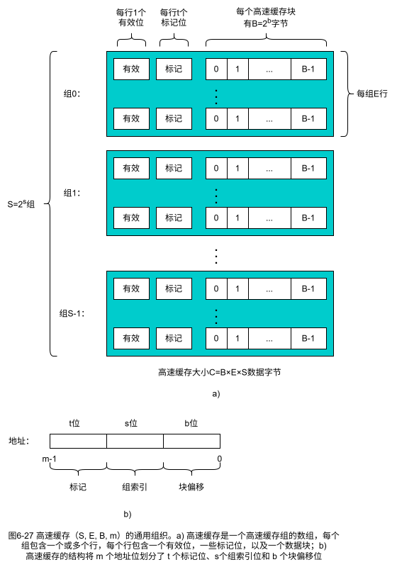
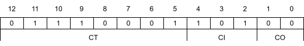
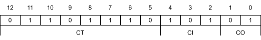
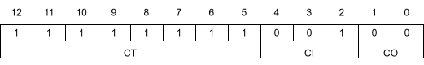
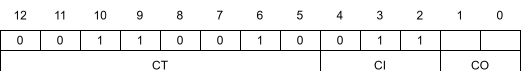

# 第6章 存储器层次结构

## 练习题

### 练习题 6.1

接下来，设 r 表示一个 DRAM 阵列中的行数，c 表示列数，b<sub>r</sub> 表示行寻址所需的位数，b<sub>c</sub> 表示列寻址所需的位数。
对于下面每个 DRAM，确定 2 的幂数的阵列维数，使得 max(b<sub>r</sub>, b<sub>c</sub>) 最小，max(b<sub>r</sub>, b<sub>c</sub>) 是对阵列的行或者列寻址所需的位数中较大的值。

|组织|r|c|b<sub>r</sub>|b<sub>c</sub>|max(b<sub>r</sub>, b<sub>c</sub>)|
|-|-|-|-|-|-|
|16×1||||||
|16×4||||||
|128×8||||||
|512×4||||||
|1024×4||||||

答案：

|组织|r|c|b<sub>r</sub>|b<sub>c</sub>|max(b<sub>r</sub>, b<sub>c</sub>)|
|-|-|-|-|-|-|
|16×1|4|4|2|2|2|
|16×4|4|4|2|2|2|
|128×8|16|8|4|3|4|
|512×4|32|16|5|4|5|
|1024×4|32|32|5|5|5|

### 练习题 6.2

计算这样一个磁盘的容量，它有 2 个盘片，10000 个柱面，每条磁道平均有 400 个扇区，而每个扇区有 512 个字节。

答案：

512 \* 400 \* 10000 \* 2 \* 2 = 8192000000 ≈ 8.19G

### 练习题 6.3

估计访问下面这个磁盘上一个扇区的访问时间（以 ms 为单位）：

|参数|值|
|-|-|
|旋转速率|15 000RPM|
|T<sub>avg seek</sub>|8ms|
|每条磁道的平均扇区数|500|

答案：

最大旋转延迟为：

<math display="block">
  <mrow>
    <msub><mtext>T</mtext><mtext>max rotation</mtext></msub>
    <mo>=</mo>
    <mfrac>
      <mn>1</mn>
      <mtext>RPM</mtext>
    </mfrac>
    <mo>×</mo>
    <mfrac>
      <mrow>
        <mn>60</mn><mtext>secs</mtext>
      </mrow>
      <mrow>
        <mn>1</mn><mtext>min</mtext>
      </mrow>
    </mfrac>
  </mrow>
</math>

平均旋转时间 T<sub>avg rotation</sub> 是 T<sub>max rotation</sub> 的一半。

一个扇区以秒为单位的平均传送时间如下：


<math display="block">
  <mrow>
    <msub><mtext>T</mtext><mtext>avg transfer</mtext></msub>
    <mo>=</mo>
    <mfrac>
      <mn>1</mn>
      <mtext>RPM</mtext>
    </mfrac>
    <mo>×</mo>
    <mfrac>
      <mn>1</mn>
      <mrow>
          <mo>(</mo><mtext>平均扇区数</mtext><mo>/</mo><mtext>磁道</mtext><mo>)</mo>
      </mrow>
    </mfrac>
    <mo>×</mo>
    <mfrac>
      <mrow>
        <mn>60</mn><mtext>secs</mtext>
      </mrow>
      <mrow>
        <mn>1</mn><mtext>min</mtext>
      </mrow>
    </mfrac>
  </mrow>
</math>

平均旋转时间为：

T<sub>avg rotation</sub>=1/2×(60/15000RPM)×1000ms/sec=2ms

平均传送时间为：

T<sub>avg transfer</sub>=60/15000RPM × 1/500扇区/磁道 × 1000ms/sec ≈ 0.008ms
整个估计的访问时间为：

T<sub>access</sub>=T<sub>avg seek</sub>+T<sub>avg rotation</sub>+T<sub>avg transfer</sub>=8ms+2ms+0.008ms≈10ms

### 练习题 6.4

假设 1MB 的文件由 512 个字节的逻辑块组成，存储在具有如下特性的磁盘驱动器上：

|参数|值|
|-|-|
|旋转速率|10 000RPM|
|T<sub>avg seek</sub>|5 ms|
|平均扇区数/磁道|1000|
|表面|4|
|扇区大小|512 字节|

对于下面的情况，假设程序顺序地读文件的逻辑块，一个接一个，将 读/写 头定位到第一块上的时间是 T<sub>avg seek</sub>+T<sub>avg rotation</sub>。

* A. 最好的情况：给定逻辑块到磁盘扇区的最好的可能的映射（即顺序的），估计读这个文件需要的最优时间（以 ms 为单位）。
* B. 随机的情况：如果块是随机地映射到磁盘扇区的，估计读这个文件需要的时间（以 ms 为单位）。

答案：

1MB ≈ (1000 × 1000 / 512) 扇区数 = 2000 扇区数

* A

T<sub>avg rotation</sub>=1/2 × (60/10000RPM) × 1000ms/sec = 3ms

T<sub>transfer</sub>=60/10000RPM × 1/1000扇区/磁道 × 1000ms/sec × (1000 × 1000 / 512) 扇区数 ≈ 12ms

T<sub>access</sub>=5ms+3ms+12ms=20ms

* B

k = 2000 扇区数

T<sub>access</sub>=(5ms+3ms+12ms/k) × k≈16000ms

### 练习题 6.5

使用图 6-14 中的区图，确定下面这两个区中备用柱面的数量:

* A 区 0
* B 区 8

|区号|扇区数/磁道|柱面数/区域|逻辑块/区域|
|-|-|-|-|
|(最外层)0|864|3201|22,076,928|
|1|844|3200|21,559,136|
|2|816|3400|22,149,504|
|3|806|3100|19,943,664|
|4|795|3100|19,671,480|
|5|768|3400|20,852,736|
|6|768|3450|21,159,936|
|7|725|3650|21,135,200|
|8|704|3700|20,804,608|
|9|672|3700|19,858,944|
|10|640|3700|18,913,280|
|11|603|3700|17,819,856|
|12|576|3707|17,054,208|
|13|528|3060|12,900,096|
|(最内层)14|-|-|-|

**图6-14 Seagate Cheetah 15K.4 的区图。来源:DIXtrac自动磁盘驱动器描述工具[92]。没有区14的数据**

答案：

8 为盘面数，参看 图 6-13，这里不提供。

* A

864 × 3201 × 8 - 22,076,928 = 48,384 扇区

48,384 / 8 / 864 = 7 个备用柱面

* B

704 × 3700 × 8 - 20,804,608 = 33,792 扇区

33,792 / 8 / 704 = 6 个备用柱面

### 练习题 6.6

正如我们已经看到的，SSD 的一个潜在的缺陷是底层闪存会磨损。
例如，一个主要的制字节造商保证他们的SSD能够经得起1PB(10^15字节)的随机写。
给定这样的假设，根据下面的工作负载，估计图 6-16 中的 SSD 的寿命(以年为单位):

* A. 顺序写的最糟情况: 以170MB/s(该设备的平均顺序写吞吐量)的速度持续地写SSD。
* B. 随机写的最糟情况: 以14MB/s(该设备的平均随机写吞吐量)的速度持续地写SSD。
* C. 平均情况: 以20GB/天(某些计算机制造商在他们的移动计算机工作负载模拟测试中假设的平均每天写速率)的速度写SSD。

答案:

1PB = 10^9 M

* A

10^9M / 170M/s / 3600 / 24 / 365 ≈ 0.2 年

* B

10^9M / 14M/s / 3600 / 24 / 365 ≈ 2.264 年

* C

10^9M / (20000M) / 365 ≈ 137 年

### 练习题 6.7

使用图 6-17c 中从 2000 年到 2010 年的数据，估计到哪一年你可以以 500 美元的价格买到一个 1PB(10<sup>15</sub>字节)的旋转磁盘。
假设美元价值不变（没有通货膨胀）。

答案：

这10年间，美元/MB 降价了 0.01/0.0003 ≈ 33 倍。

大约每两年相同容量的硬盘会降价一半。

2010年，要买 1PB 硬盘大约需要 $300,000。
每两年降价一半，大约到 2030 年可以以 $500 购买 1PB 的硬盘。

### 练习题 6.8

改变下面函数中循环的顺序，使得它以步长为 1 的引用模式扫描三维数组 a:

```c
int sumarray3d(int a[N][N][N])
{
  int i, j, k, sum = 0;

  for (i = 0; i < N; i++) {
    for (j = 0; j < N; j++) {
      for (k = 0; k < N; k++) {
        sum += a[k][i][j];
      }
    }
  }
  return sum;
}
```

答案：

```c
int sumarray3d(int a[N][N][N])
{
  int i, j, k, sum = 0;

  for (i = 0; i < N; i++) {
    for (j = 0; j < N; j++) {
      for (k = 0; k < N; k++) {
        sum += a[i][j][k];
      }
    }
  }
  return sum;
}
```

### 练习题 6.9

就下面三个函数，以不同间局部性程度，执行相同的操作。

请对这些函数就空间局部性进行排序。解释你是如何得到排序结果的。

```c
#define N 1000

typedef struct {
  int vel[3];
  int acc[3];
} point;

point p[N];

void clear1(point *p, int n)
{
  int i, j;

  for (i = 0; i < n; i++) {
    for (j = 0; j < 3; j++)
      p[i].vel[j] = 0;
    for (j = 0; j < 3; j++)
      p[i].acc[j] = 0;
  }
}

void clear2(point *p, int n)
{
  int i, j;

  for (i = 0; i < n; i++) {
    for (j = 0; j < 3; j++) {
      p[i].vel[j] = 0;
      p[i].acc[j] = 0;
    }
  }
}

void clear3(point *p, int n)
{
  int i, j;

  for (j = 0; j < 3; j++) {
    for (i = 0; i < n; i++)
      p[i].vel[j] = 0;
    for (i = 0; i < n; i++)
      p[i].acc[j] = 0;
  }
}
```

答案：

clear1 以步长为 1 的引用模式访问元素，clear2 在内循环中以 0,12,4,16,8,20 的偏移访问元素，因此局部性比 clear1 差，
clear3 在内循环中进行了跨 struct 的元素访问，局部性比 clear2 更差，因此：

clear1 &gt; clear2 &gt; clear3

### 练习题 6.10

下表给出了一个不同的高速缓存的参数。

确定每个高速缓存的高速缓存组数（S）、标记位数（t）、组索引位数（s）以及块偏移位数（b）。

|高速缓存|m|C|B|E|S|t|s|b|
|-|-|-|-|-|-|-|-|-|
|1.|32|1024|4|1|||||
|2.|32|1024|8|4|||||
|3.|32|1024|32|32|||||

附录：

考虑一个计算机系统，其中每个存储器地址有 m 位，形成 M=2<sup>m</sup> 个不同的地址。
如图 6-27a 所示，这样一个机器的高速缓存被组织成一个有 S=2<sup>s</sup> 个高速缓存组的数组。
每个组包含 E 个高速缓存行。
每个行是由一个 B=2<sup>b</sup> 字节的数据块组成一个，一个有效位指明这个行是否包含有意义的信息，还有 t=m-(b+s) 个标记位，它们唯一地标识存储在这个高速缓存行中的块。



高速缓存的结构可以用元组 (S, E, B,  m) 来描述。
高速缓存的大小（或容量）C 指的是所有块的大小的和。
标记位和有效位不包括在内。因此，C=S×E×B。

<table>
  <thead>
    <tr><th colspan=2>基本参数</th></tr>
  </thead>
  <tbody>
    <tr><td>参数</td><td>描述</td></tr>
    <tr><td>S=2<sup>s</sup></td><td>组数</td></tr>
    <tr><td>E</td><td>每个组的行数</td></tr>
    <tr><td>B=2<sup>b</sup></td><td>块大小(字节)</td></tr>
    <tr><td>m=log<sub>2</sub>(M)</td><td>(主存)物理地址位数</td></tr>
  </tbody>
</table>

<table>
  <thead>
    <tr><th colspan=2>衍生出来的量</th></tr>
  </thead>
  <tbody>
    <tr><td>参数</td><td>描述</td></tr>
    <tr><td>M=2<sup>m</sup></td><td>存储器的最大数量</td></tr>
    <tr><td>s=log<sub>2</sub>(S)</td><td>组索引位数量</td></tr>
    <tr><td>b=log<sub>2</sub>(B)</td><td>块偏移位数量</td></tr>
    <tr><td>t=m-(s+b)</td><td>标记位数量</td></tr>
    <tr><td>C=B×E×S</td><td>不包括像有效位和标记位这样开销的高速缓存大小(字节)</td></tr>
  </tbody>
</table>

答案：

|高速缓存|m|C|B|E|S|t|s|b|
|-|-|-|-|-|-|-|-|-|
|1.|32|1024|4|1|256|22|8|2|
|2.|32|1024|8|4|32|24|5|3|
|3.|32|1024|32|32|1|27|0|5|

### 练习题 6.11

在前面 `dotprod` 的例子中，在我们对数组 x 做了填充之后，所有对 x 和 y 的引用的命中率是多少?

答案：`3/4`

### 练习题 6.12

一般而言，如果一个地址的高 `s` 位被用做组索引，那么存储器块连续的片(chunk)会被映射到同一个高速缓存组。

* A. 每个这样的连续的数组片中有多少个块?
* B. 考虑下面的代码，它运行在一个高速缓存形式为 `(S，E，B，m)=(512，1, 32, 32)` 的系统上:

```C
int array[4096];
for (i = 0; i < 4096; i++)
  sum += array[i];
```

在任意时刻，存储在高速缓存中的数组块的最大数量为多少?

答案：

* A

每个连续的数组片有 2<sup>t</sup> 个块。

* B

|m|C|B|E|S|t|s|b|
|-|-|-|-|-|-|-|-|
|32|16,384|32|1|512|18|9|5|

每 2<sup>t</sup>=2<sup>18</sup> 个块会共用一个缓存组，假设 `array[4096]` 放在地址为 0 开始的内存上，
`(4096 * 4) / 32 = 512` 个块，整个数组都会映射到组号为 0 的缓存组上，在任意时刻，高速缓存中的数组块最大的数量为 1。

### 练习题 6.13

下面的问题能帮助你加强理解高速缓存是如何工作的。
有如下假设:

* 存储器是字节寻址的。
* 存储器访问的是1字节的字(不是4字节的字)。
* 地址的宽度为13位。
* 高速缓存是2路组相联的(E=2)，块大小为4字节(B-4)，有8个组(S=8)。

高速缓存的内容如下，所有的数字都是以十六进制来表示的。

2 路组相联高速缓存

<table>
  <thead>
    <tr><th></th><th colspan=6>行 0</th><th colspan=6>行 1</th></tr>
    <tr><th>组索引</th><th>标记位</th><th>有效位</th><th>字节 0</th><th>字节 1</th><th>字节 2</th><th>字节 3</th><th>标记位</th><th>有效位</th><th>字节 0</th><th>字节 1</th><th>字节 2</th><th>字节 3</th></tr>
  </thead>
  <tbody>
    <tr><td>0</td><td>09</td><td>1</td><td>86</td><td>30</td><td>3F</td><td>10</td><td>00</td><td>0</td><td>-</td><td>-</td><td>-</td><td>-</td></tr>
    <tr><td>1</td><td>45</td><td>1</td><td>60</td><td>4F</td><td>E0</td><td>23</td><td>38</td><td>1</td><td>00</td><td>BC</td><td>0B</td><td>37</td></tr>
    <tr><td>2</td><td>EB</td><td>0</td><td>-</td><td>-</td><td>-</td><td>-</td><td>0B</td><td>0</td><td>-</td><td>-</td><td>-</td><td>-</td></tr>
    <tr><td>3</td><td>06</td><td>0</td><td>-</td><td>-</td><td>-</td><td>-</td><td>32</td><td>1</td><td>12</td><td>08</td><td>7B</td><td>AD</td></tr>
    <tr><td>4</td><td>C7</td><td>1</td><td>06</td><td>78</td><td>07</td><td>C5</td><td>05</td><td>1</td><td>40</td><td>67</td><td>C2</td><td>3B</td></tr>
    <tr><td>5</td><td>71</td><td>1</td><td>0B</td><td>DE</td><td>18</td><td>4B</td><td>6E</td><td>0</td><td>-</td><td>-</td><td>-</td><td>-</td></tr>
    <tr><td>6</td><td>91</td><td>1</td><td>A0</td><td>B7</td><td>26</td><td>2D</td><td>F0</td><td>0</td><td>-</td><td>-</td><td>-</td><td>-</td></tr>
    <tr><td>7</td><td>46</td><td>0</td><td>-</td><td>-</td><td>-</td><td>-</td><td>DE</td><td>1</td><td>12</td><td>C0</td><td>88</td><td>37</td></tr>
  </tbody>
</table>

下面的方框展示的是地址格式（每个小方框一个位）。
指出（在图中标出）用来确定下列内容的字段：

* CO 高速缓存块偏移
* CI 高速缓存组索引
* CT 高速缓存标记


答案：


### 练习题 6.14

假设一个程序运行在练习题 6.13 中的机器上，它引用地址 0x0E34 处的 1 个字节的字。
指出访问的高速缓存条目和十六进制表示的返回的高速缓存字节值。
指出是否会发生缓存不命中。
如果会发生缓存不命中，用“-”来表示“返回的高速缓存字节”。

* A 地址格式（每个小方框一个位）:


* B 存储器引用

|参数|值|
|-|-|
|高速缓存块偏移（CO）|0x____|
|高速缓存组索引（CI）|0x____|
|高速缓存标记（CT）|0x____|
|高速缓存命中？（是/否）||
|返回的高速缓存字节|0x____|

答：

* A



* B

|参数|值|
|-|-|
|高速缓存块偏移（CO）|0x0|
|高速缓存组索引（CI）|0x5|
|高速缓存标记（CT）|0x71|
|高速缓存命中？（是/否）|是|
|返回的高速缓存字节|0x0B|

### 练习题 6.15

对于存储器地址 0x0DD5，再做一遍练习题 6.14。

* A 地址格式（每个小方框一个位）:


* B 存储器引用

|参数|值|
|-|-|
|高速缓存块偏移（CO）|0x____|
|高速缓存组索引（CI）|0x____|
|高速缓存标记（CT）|0x____|
|高速缓存命中？（是/否）||
|返回的高速缓存字节|0x____|

答：

* A



* B

|参数|值|
|-|-|
|高速缓存块偏移（CO）|0x1|
|高速缓存组索引（CI）|0x5|
|高速缓存标记（CT）|0x6D|
|高速缓存命中？（是/否）|否|
|返回的高速缓存字节|-|

### 练习题 6.16

对于存储器地址 0x1FE4，再做一遍练习题 6.14。

* A 地址格式（每个小方框一个位）:


* B 存储器引用

|参数|值|
|-|-|
|高速缓存块偏移（CO）|0x____|
|高速缓存组索引（CI）|0x____|
|高速缓存标记（CT）|0x____|
|高速缓存命中？（是/否）||
|返回的高速缓存字节|0x____|

答：

* A



* B

|参数|值|
|-|-|
|高速缓存块偏移（CO）|0x0|
|高速缓存组索引（CI）|0x1|
|高速缓存标记（CT）|0xFF|
|高速缓存命中？（是/否）|否|
|返回的高速缓存字节|-|

### 练习题 6.17

对于练习题 6.13 中的高速缓存，列出所有在组 3 中会命中的十六进制存储器地址。

答：

组 3 中只有标记为（CT）0x23 的缓存行有效：



也就是说符合条件的有效地址有：

* 0x64C
* 0x64D
* 0x64E
* 0x64F

### 练习题 6.18

在信号处理和科学计算的应用中，转置矩阵的行和列是一个很重要的问题。

从局部性的角度来看，它也很有趣，因为它的引用模式是以行为主(row-wise)的，也是以列为主(column-wise)的。

例如，考虑下面的转置函数: