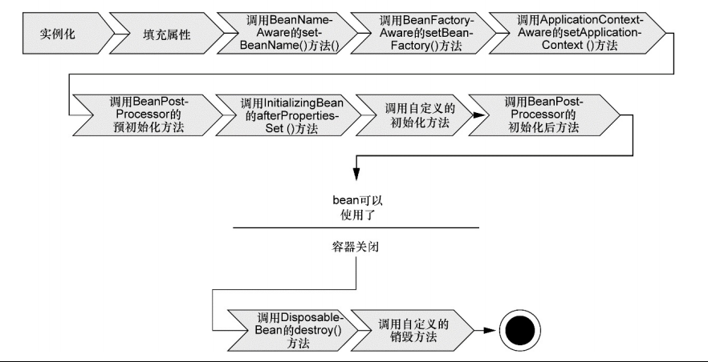
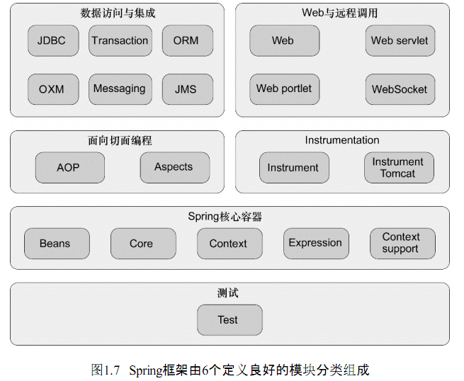

## 第一章 Spring之旅

### 简化Java开发

Spring最根本的使命：简化Java开发。

为了降低Java开发的复杂性，Spring采取了一下4种关键策略：

* 基于POJO的轻量级和最小侵入性编程
* 通过依赖注入和面向接口实现松耦合
* 基于切面和惯例进行声明式编程
* 通过切面和模板减少样板式代码

### 容纳你的Bean

Spring自带了多种类型的应用上下文，下面罗列的几个是你最有可能遇到的：

* AnnotationConfigApplicationContext：从一个或多个基于Java的配置类中加载Spring应用上下文
* AnnotationConfigWebApplicationContext：从一个或多个基于Java的配置类中加载Spring Web应用上下文
* ClassPathXmlApplicationContext：从类路径下的一个或多个XML配置文件中加载上下文定义，把应用上下文的定义文件作为类资源
* FileSystemXmlApplicationContext：从文件系统下的一个或多个XML配置文件中加载上下文定义

bean装载到Spring应用上下文中的一个典型的生命周期过程为：

1. Spring对bean进行实例化
1. Spring将值和bean的引用注入到bean对应的属性中
1. 如果bean实现了BeanNameAware接口，Spring将bean的ID传递给setBeanName() 方法
1. 如果bean实现了BeanFactoryAware接口，Spring将调用setBeanFactory()方法，将BeanFactory容器实例传入
1. 如果bean实现了ApplicationContextAware接口，Spring将调用setApplicationContext()方法，将bean所在的应用上下文引用传入进来
1. 如果bean实现了BeanPostProcessor接口，Spring将低啊用它们的postProcessBeforeInitialization()方法
1. 如果bean实现来了InitializingBean接口，Spring将调用它们的afterPropertiesSet() 方法。类似地，如果bean使用init方法声明了初始化方法，该方法也会被调用
1. 如果bean实现了BeanPostProcessor接口，Spring将调用它们的postProcessAfterInitialization()方法
1. 此时，bean已经准备就绪，可以被应用程序使用了，它们将一直驻留在应用上下文中，知道该应用上下文被销毁
1. 如果bean实现了DisposableBean接口，Spring将调用它的destroy()接口方法。同样，如果bean使用destroy-method声明了销毁方法，该方法也会被调用

### 俯瞰Spring风景线

