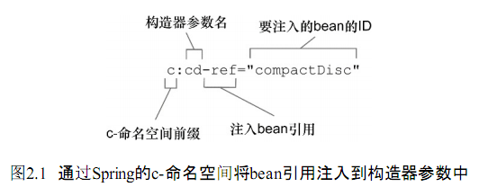
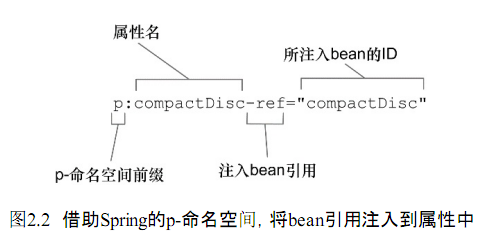

## 第2章 装配 Bean

### 2.2 自动化装配Bean

1. @ComponentScan 默认会扫描与配置类相同的包，查找带有 @Component 注解的类，为其创建一个 bean。
2. @Component 默认设置的 bean ID 为将类名的第一个字母变为小写
3. @ComponentScan("soundsystem") 可以指定基础包名，也可以通过 basePackages 指定，比如 @ComponentScan(basePackages={"soundsystem","video")
4. @Autowired 注解可以用在构造器上，也可以用在属性的 Setter 方法上。Spring 初始化bean之后，会尽可能去满足bean的依赖，假如有且只有一个 bean 匹配满足依赖需求的话，那么这个bean将会被装配进来，如果没有匹配的bean会抛出一个异常。为了避免异常可以将 @Autowired的required属性设置为false。如果有多个bean都能满足依赖关系的话,Spring将会抛出一个异常，表明没有明确指定要选择哪个bean进行自动装配。

### 通过Java代码装配Bean

1. 在进行显式配置时，JavaConfig是更好的方案，因为它更为强大、类型安全并且对重构友好。
2. 带有 @Bean 注解的方法可以采用任何必要的 Java 功能来产生 bean 实例。构造器和 Setter 方法只是 @Bean 方法的两个简单样例。这里所存在的可能性仅仅受到 Java 语言的限制。

### 通过XML装配bean

1. 在XML中声明DI时，会有多种可选的配置方案和风格。具体到构造器注入，有两种基本的配置方案可供选择
    * &lt;constructor-arg&gt;元素
    * 使用Spring3.0所引入的c-命名空间
2. 在c-命名空间和模式声明之后，我们就可以使用它来声明构造器参数了，比如：
    &lt;bean id="cdPlayer" class="soundsystem.CDPlayer" c:cd-ref="compactDisc" /&gt;

属性名以"c:"开头，也就是命名空间的前缀。接下来就是要装配的构造器参数名，在此之后是"-ref"，这是一个命名的约定，他会告诉Spring，正在装配的是一个bean的引用，这个bean的名字是compactDisc，而不是字面量"compactDisc"。
3. &lt;bean id="cdPlayer" class="soundsystem.CDPlayer" p:compactDisc-ref="compactDisc" /&gt;
p-命名空间中的属性所遵循的命名约定与c-命名空间中的属性类似。

4. Spring util-命名空间中的元素
    |元素|描述|
    |-|-|
    |&lt;util:constant&gt;|引用某个类型的public static域，并将其暴露为bean|
    |util::list|创建一个java.util.List类型的bean，其中包含值或引用|
    |util::map|创建一个java.util.Map类型的bean，其中包含值或引用|
    |util::properties|创建一个java.util.Properties类型的bean|
    |util::property-path|引用一个bean的属性（或内嵌属性），并将其暴露为bean|
    |util::set|创建一个java.util.Set类型的bean，其中包含值或引用|

### 导入和混合配置

1. 关于混合配置，第一件需要了解的事情就是在自动装配时，它并不在意要装配的bean来自哪里。自动装配的时候会考虑Spring容器中所有的bean，不管它是在JavaConfig或XML中声明的还是通过组建扫描获取到的。

### 小结

Spring框架的核心是Spring容器。容器负责管理应用中组件的生命周期，它会创建这些组件并保证它们的依赖能够得到满足。尽可能使用自动化配置，以避免显式配置所带来的维护成本。如果确实需要显式配置Spring的话，应该优先选择基于Java的配置，它比基于XML的配置更加强大、类型安全并且易于重构。