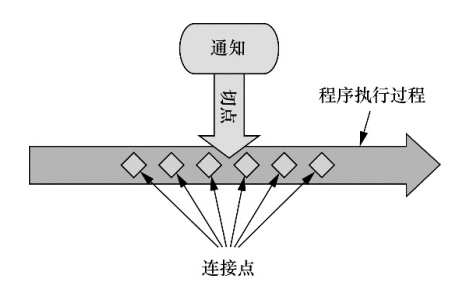
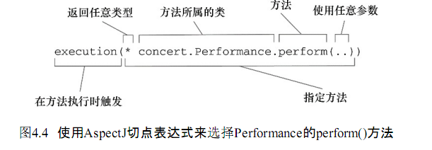
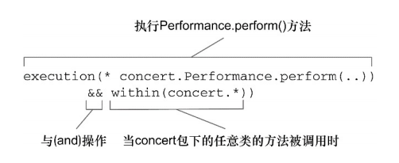
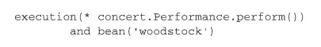
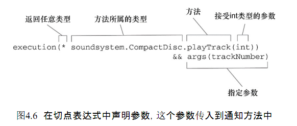

## 第4章 面向切面的Spring

### 什么是面向切面编程

如果要重用通用功能的话，最常见的面向对象技术是继承或委托。
但是如果在整个应用中都使用相同的基类，继承往往会导致一个脆弱的对象体系；而使用委托可能需要对委托对象进行复杂的调用。

切面提供了取代继承和委托的另一种可选方案。在使用面向切面编程时，我们仍然在一个地方定义通用功能，但是可以通过声明的方式定义这个功能要以何种方式在何处应用，而无需修改受影响的类。横切关注点可以被模块化为特殊的类，这些类被称为切面（aspect）。

这样做有两个好处：首先，现在关注点都集中于一个地方，而不是分散到多处代码中；其次，服务模块更简洁，因为它们只包含主要关注点的代码，而次要关注点的代码被转移到切面中了。

与大多数技术一样， AOP 已经形成了自己的术语。描述切面的常用术语有通知（advice）、切点（pointcut）和连接点（join point）。



* 通知（Advice）：在 AOP 术语中，切面的工作被称为通知，通知定义了切面是什么以及何时使用。除了描述切面要完成的工作，通知还解决了何时执行这个工作的问题。
Spring 切面可以应用 5 中类型的通知：
    * 前置通知（Before）：在目标方法被调用之前调用通知功能
    * 后置通知（After）：在目标方法完成之后调用通知，此时不会关心方法的输出是什么
    * 返回通知（After-returning）：在目标方法成功执行之后调用通知
    * 异常通知（After-throwing）：在目标方法抛出异常后调用通知
    * 环绕通知（Around）：通知包裹了被通知的方法，在被通知的方法调用之前和调用之后执行自定义的行为
* 连接点（Join point）：连接点是在应用执行过程中能够插入切面的一个点。这个点可以是调用方法时、抛出异常时、甚至修改一个字段时。切面代码可以利用这些点插入到应用的正常流程之中，并添加新的行为。
* 切点（Pointcut）：切点的定义会匹配通知所要织入的一个或多个连接点。我们通常使用明确的类和方法名称，或是利用正则表达式定义所匹配的类和方法名称。有些 AOP 框架允许我们创建动态的切点，可以根据运行时的决策来决定是否应用通知
* 切面（Aspect）：切面时通知和切点和结合。通知和切点共同定义了切面的全部内容——它时很么，在何时和何处完成其功能
* 引入（Introduction）：引入允许我们向现有的类添加新方法或属性
* 织入（Weaving）：织入时把切面应用到目标对象并创建代理对象的过程。在目标对象的生命周期里有多个点可以进行织入：
    * 编译期：切面在目标类编译时织入。这种方式需要特殊的编译器。AspectJ 的织入编译器就是以这种方式织入切面的
    * 类加载期：切面在目标类加载到 JVM 时被织入。这种方式需要特殊的类加载器（ClassLoader），它可以在目标类被引入之前增强该目标类的字节码。AspectJ 5 的加载织入（load-time weaving，LTW）就支持这种方式织入切面
    * 运行期：切面在应用运行的某个时刻被织入。一般情况下，在织入切面时，AOP 容器会为目标对象动态地创建一个代理对象。Spring AOP 就是以这种方式织入切面的

Spring 提供了 4 种类型的 AOP 支持

* 基于代理的经典 Spring AOP
* 纯 POJO 切面
* @AspectJ 注解驱动的切面
* 注入式 AspectJ 切面（适用于 Spring 各版本）

因为 Spring 基于动态代理，所以 Spring 只支持方法连接点

### 通过切点来选择连接点

Spring仅支持 AspectJ 切点指示器（pointcut designator）的一个子集。Spring是基于代理的，而某些切点表达式是与基于代理的AOP无关的。

|AspectJ指示器|描述|
|-|-|
|arg()|限制连接点匹配参数为指定类型的执行方法|
|@args()|限制连接点匹配参数由指定注解标注的执行方法|
|execution()|用于匹配是连接点的执行方法|
|this()|限制连接点匹配AOP代理的bean引用为执行类型的类|
|target|限制连接点匹配目标对象为指定类型的类|
|@target()|限制连接点匹配特定的执行对象，这些对象对应的类要具有指定类型的注解|
|within()|限制连接点匹配指定的类型|
|@within()|限制连接点匹配指定注解所标注的类型（当使用Spring AOP时，方法定义在由指定的注解所标注的类里）|
|@annotation|限定匹配带有指定注解的连接点|

在Spring中尝试使用AspectJ其他指示器时，将会抛出IllegalArgument-Exception异常。



现在假设我们需要配置的切点仅匹配concert包。在此场景下，可以使用within()指示器来限制匹配：



Spring还引入了一个新的bean()指示器，它允许我们在切点表达式中使用bean的ID来标识bean。



在这里，我们希望在执行Performance的perform()方法时应用通知，但限定bean的ID为woodstock

### 使用注解创建切面

AspectJ提供了五个注解来定义通知：

|注解|通知|
|-|-|
|@After|通知方法会在目标方法返回或抛出异常后调用|
|@AfterReturning|通知方法会在目标方法返回后调用|
|@AfterThrowing|通知方法会在目标方法抛出异常后调用|
|@Around|通知方法会将目标方法封装起来|
|@Before|通知方法会在目标方法调用之前执行|

@Pointcut注解能够在一个@AspectJ切面内定义可重用的切点。

如果你使用JavaConfig的话，可以在配置类的类级别上通过使用EnableAspectJAutoProxy 注解启用自动代理功能。

假如你在Spring中要使用XML来装配bean的话，那么需要使用Spring aop命名空间中的&lt;aop:aspectj-autoproxy&gt;元素。

Spring的AspectJ自动代理仅仅使用@AspectJ作为创建切面的指导，切面依然是基于代理的。这意味着尽管使用的是@AspectJ注解，但我们仍然限于代理方法的调用。



```java
package concert;

import org.aspectj.lang.annotation.Aspect;
import org.aspectj.lang.annotation.DeclareParents;

@Aspect
public class EncoreableIntroducer {
    @DeclareParents(value="concert.Performance+",
                    defaultImpl=DefaultEncoreable.class)
    public static Encoreable encoreable;
}
```

EncoreableIntroducer通过@DeclareParents注解，将Encoreable接口引入到Performance bean中。

@DeclareParents注解由三部分组成：

* value属性指定了哪种类型的bean要引入该接口
* defaultImpl属性指定了为引入功能提供实现的类
* @DeclareParents注解所标注的静态属性指明了要引入的接口

### 在XML中声明切面

在Spring的aop命名空间中，提供了多个元素用来在XML中声明切面：

|AOP配置元素|用途|
|-|-|
|&lt;aop:advisor&gt;|定义AOP通知器|
|&lt;aop:after&gt;|定义AOP后置通知（不管被通知的方法是否执行成功）|
|&lt;aop:after-returning&gt;|定义AOP返回通知|
|&lt;aop:after-throwing&gt;|定义AOP异常通知|
|&lt;aop:around&gt;|定义AOP环绕通知|
|&lt;aop:aspect&gt;|定义一个切面|
|&lt;aop:aspectj-autoproxy&gt;启用@AspectJ注解驱动的切面|
|&lt;aop:before&gt;|定义一个AOP前置通知|
|&lt;aop:config&gt;|顶层的AOP配置元素。大多数&lt;aop:\*&gt;元素必须包含在&lt;aop:config&gt;元素内|
|&lt;aop:declare-parents&gt;|以透明的方式被通知的对象引入额外的接口|
|&lt;aop:pointcut&gt;|定义一个切点|

### 注入AspectJ切面

```XML
<bean class="com.springinaction.springidol.CriticAspect"
  factory-method="aspectOf">
  <property name="criticismEngine" ref="criticismEngine" />
</bean>
```

通常情况下，Spring bean由Spring容器初始化，但是AspectJ切面是由AspectJ在运行期创建的。等到Spring有机会为CriticAspect注入CriticismEngine时，CriticAspect已经被实例化了，AspectJ切面提供了一个静态的aspectOf()方法，返回切面的一个单例，所以为了获得切面的实例，我们必须使用factory-method来调用aspectOf()方法而不是调用CriticAspect的构造器方法。
