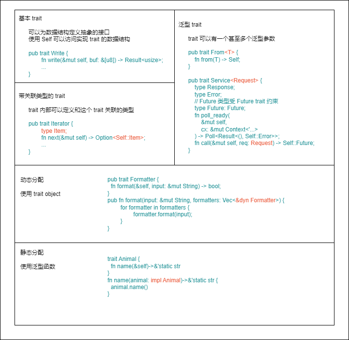

# 陈天 Rust 编程第一课

## 基础篇

### 03 初窥门径：从你的第一个Rust程序开始！

* [hello world](03_grammar/hello_world/)
* [第一个实用的 Rust  程序](03_grammar/scrape_url/)
* [函数作为参数](03_grammar/apply/)
* [返回值类型](03_grammar/pi/)
* [数据结构](03_grammar/user/)
* [控制流程](03_grammar/fib/)
* [思考题1](03_grammar/fib2/)
* [思考题2](03_grammar/scrape_url2/)

### 04 get hands dirty：来写个实用的CLI小工具

* [HTTPie命令行解析](04_httpie/httpie1/)
* [HTTPie添加参数验证](04_httpie/httpie2/)
* [HTTPie添加主体功能](04_httpie/httpie3/)
* [HTTPie添加高亮显示](04_httpie/httpie4/)
* [HTTPie body 显示优化](04_httpie/httpie5/)

### 05 get hands dirty：做一个图片服务器有多难？

* [Thumbor](05_thumbor/thumbor/)

### 06 gethandsdirty：SQL查询工具怎么一鱼多吃？

* [queryer](06_queryer/queryer)
* [queryer-js](06_queryer/queryer-js)
* [queryer-py](06_queryer/queryer-py)
* [data-viewer](06_queryer/data-viewer)


### 07 所有权：值的生杀大权到底在谁手上？

* [ownership](07_ownership)

#### 思考题

1. 在 Rust 下，分配在堆上的数据结构可以引用栈上的数据么？为什么？

可以，只要栈上的属生命周期大于堆上数据的生命周期就可以，简单的例子可以看代码 heap_ref_stack.rs

2. main() 函数传递给 find\_pos() 函数的另一个参数 v，也会被移动吧？为什么图上并没有将其标灰？

不会，参数 v 是基本数据类型 u32，实现了 Copy trait

### 08 所有权：值的借用是如何工作的？

* [borrow](08_borrow)

为了保证内存安全，Rust 对可变引用的使用做了严格的约束：

1. 在一个作用域内，仅允许一个活跃的可变引用
2. 活跃的可变引用（写）和只读引用（读）是互斥的，不能同时存在

小结：

1. 一个值在同一时刻只有一个所有者。当所有者离开作用域，其拥有的值会被丢弃。赋值或者传参会导致值 Move，所有权被转移，一旦所有权转移，之前的变量就不能访问
2. 如果值实现了 Copy trait，那么赋值或传参会使用 Copy 语义，相应的值会被按位拷贝，产生新的值
3. 一个值可以有多个只读引用
4. 一个值可有唯一一个活跃的可变引用。可变引用和只读引用是互斥的关系，就像并发下数据的读写互斥那样
5. 引用的生命周期不能超出值的生命周期


#### 思考题

1. 上一讲我们在讲 Copy trait 时说道，可变引用没有实现 Copy trait。结合这一讲的内容，想想为什么？

可变引用如果可以 Copy 就违背了一个值可有唯一一个活跃的可变引用的约束

2. 下面这段代码，如何修改才能使其编译通过，避免同时有只读引用和可变引用？

```rust
fn main() {
    let mut arr = vec![1, 2, 3];
    // cache the last item
    let last = arr.last();
    arr.push(4);
    // consume previously stored last item
    println!("last: {:?}", last);
}
```

方法一：克隆最后一个元素
方法二：打印 last 后，再push

详细请看代码 exam.rs

### 09 所有权：一个值可以有多个所有者么？

* [multi owner](09_multi_owner)

外部可变性和内部可变性的区别：

||**使用方法**|**所有权检查**|
|-|-|-|
|**外部可变性**|let mut或者 &mut|编译时，如果不符合规则，产生编译错误|
|**内部可变性**|使用 Cell/RefCell|运行时，如果不符合规则，产生 panic|

Rc/Arc 是不可变的，如果想要修改内部的数据，**需要引入内部可变性**，在单线程环境下，可以在 Rc 内部使用 RefCell；在多线程环境下，可以使用 Arc 嵌套 Mutex 或者 RwLock 的方法。

<table>
    <thead>
        <tr>
            <th colspan=2>访问方式</th>
            <th>数据</th>
            <th>不可变借用</th>
            <th>可变借用</th>
        </tr>
    </thead>
    <tbody>
        <tr>
            <td colspan=2>单一所有权</td>
            <td>T</td>
            <td>&T</td>
            <td>&mut T</td>
        </tr>
        <tr>
            <td rowspan=5>共享所有权</td>
            <td rowspan=2>单线程</td>
            <td>Rc&lt;T&gt;</td>
            <td>&Rc&lt;T&gt;</td>
            <td>无法得到可变借用</td>
        </tr>
        <tr>
            <td>Rc&lt;RefCell&lt;T&gt;&gt;</td>
            <td>v.borrow()</td>
            <td>v.borrow_mut()</td>
        </tr>
        <tr>
            <td rowspan=3>多线程</td>
            <td>Arc&lt;T&gt;</td>
            <td>&Arc&lt;T&gt;</td>
            <td>无法得到可变借用</td>
        </tr>
        <tr>
            <td>Arc&lt;Mutex&lt;T&gt;&gt;</td>
            <td>v.lock()</td>
            <td>v.lock()</td>
        </tr>
        <tr>
            <td>Arc&lt;RwLock&lt;T&gt;&gt;</td>
            <td>v.read()</td>
            <td>v.write()</td>
        </tr>
    </tbody>
</table>

#### 思考题

1. 运行下面的代码，查看错误，并阅读 std::thread::spawn 的文档，找到问题原因后，修改代码使其编译通过。

```rust
fn main() {
    let arr = vec![1];

    std::thread::spawn(|| {
        println!(":?", arr);
    });
}
```

答案：使用 move，具体请看 exam1.rs

2. 你可以写一段代码，在 main() 函数里生成一个字符串，然后通过 std::thread::spawn 创建一个线程，让 main() 函数所在的主线程和新的线程共享这个字符串么？提示：使用 std::sync::Arc。

答案：具体请看 exam2.rs

3. 我们看到了 Rc 的 clone() 方法的实现：

```rust
fn clone(&self) -> Rc<T> {
    // 增加引用计数
    self.inner().inc_strong();
    // 通过 self.ptr 生成一个新的 Rc 结构
    Self::from_inner(self.ptr);
}
```

你有没有注意到，这个方法传入的参数是 &self，是个不可变引用，然而它调用了 self.inner().inc_string()，光看函数名字，它用来增加 self 的引用计数，可是，为什么这里对 self 的不可变引用可以改变 self 的内部数据呢？

答：这里引入了内部可变性，inner() 获取了 RcBox&lt;T&gt;，而 inc\_strong 的实现为：

```rust
#[inline]
fn inc_strong(&self) {
    let strong = self.strong();

    // We insert an `assume` here to hint LLVM at an otherwise
    // missed optimization.
    // SAFETY: The reference count will never be zero when this is
    // called.
    unsafe {
        hint::assert_unchecked(strong != 0);
    }

    let strong = strong.wrapping_add(1);
    self.strong_ref().set(strong);

    // We want to abort on overflow instead of dropping the value.
    // Checking for overflow after the store instead of before
    // allows for slightly better code generation.
    if core::intrinsics::unlikely(strong == 0) {
        abort();
    }
}
```

strong 为 Cell&lt;T&gt;，是内部可变的，可以使用 set 函数改变内部的引用计数

### 10 生命周期：你创建的值究竟能活多久？

* [lifetime](10_lifetime)

* 当值拥有静态生命周期，其引用也具有静态生命周期，可以用 'static 来表示。
一般来说，全局变量、静态变量、字符串字面量等，都拥有静态生命周期。
* 如果一个值是在某个作用域中定义的，可就是说它被创建在栈上或者堆上，那么其生命周期是动态的。


* 分配在堆和栈上的内存有其各自的作用域，它们的生命周期是动态的
* 全局变量、静态变量、字符串字面量、代码等内容，在编译时，会被编译到可执行文件中的 BSS/Data/RoData/Text 段，然后加载时，载入内存。因而，他们的生命周期和进程的生命周期一致，所以时静态的
* 所以，函数指针的生命周期也是静态的，因为函数在 Text 段中，只要进程活着，其内存一直存在

编译器会通过一些简单的规则为函数自动添加标注：

1. 所有引用类型的参数都有独立的生命周期 'a、'b 等
2. 如果只有一个引用型输入，它的生命周期会赋给所有输出
3. 如果有多个引用类型的参数，其中一个是 self，那么它的生命周期会赋给所有输出

当发生函数调用时，编译器需要通过函数的签名来确定，参数和返回值之间生命周期的约束。

#### 思考题

1. 如果我们把 strtok() 函数的签名写成这样，会发生什么问题？为什么它会发生这个问题？你可以试着编译一下看看。

```rust
pub fn strtok<'a>(s: &'a mut &str, delimiter: char) -> &'a str {...}
```

答：返回值的生命周期会变成和入参 s 的可变引用生命周期一样，导致返回值的生命周期结束前，我们无法使用入参 s 的非可变引用

### 11 内存管理：从创建到消亡，值都经历了什么？

* [memory](11_memory)

Rust的创造者们，重新审视了堆内存的生命周期，发现大部分堆内存的需求在于动态大小，小部分需求是更长的生命周期。

下图是大部分编程语言和 Rust 语言的生命周期对比


Drop trait 类似面向对象编程中的析构函数，当一个值要被释放，它的 Drop trait 会被调用。

#### 思考题

Result&lt;String, ()&gt; 占用多少内存？为什么？

答：还是 24 个字节，首先 () 不占内存，而 String 的第一个字段是指针，有值时不会是 0，因而 Rust 对其进行了优化，当它为空时可以表述为 ()。

### 12 类型系统：Rust的类型系统有什么特点？

* [type system](12_type_system)

从内存的角度看，类型安全是指代码，只能按照被允许的方法，访问它被授权访问的内存。

Rust 下的内存安全更严格：代码只能按照被允许的方法和被允许的权限，访问它被授权访问的内存。

为了做到这么严格的类型安全，Rust 中除了 let/fn/static/const 这些定义性的语句外，都是表达式，而一切表达式都有类型，所以可以说在 Rust 中，类型无处不在。

在声明一个函数的时候，我们可以不指定具体的参数或返回值的类型，而是由泛型参数来代替。

对于泛型函数，Rust 会进行单态化处理，也就是在编译时，把所有用到的泛型函数的泛型参数展开，生成若干个函数。

单态化的好处是，泛型函数的调用是静态分派，在编译时就一一对应，既保有多态的灵活性，又没有任何效率的损失，和普通函数调用一样高效。

因为单态化，代码以二进制分发会损失泛型的信息。


按类型定义、检查以及检查时能否被推导出来，Rust 是强类型+静态类型+显式类型

#### 思考题

下面这段代码为什么不能编译通过？你可以修改它使其正常工作么？

```rust
use std::io::{BufWriter, Write};
use std::net::TcpStream;

#[derive(Debug)]
struct MyWriter<W> {
    writer: W,
}

impl<W: Write> MyWriter<W> {
    pub fn new(addr: &str) -> Self {
        let stream = TcpStream::connect("127.0.0.1:8080").unwrap();
        Self {
            writer: BufWriter::new(stream),
        }
    }

    pub fn write(&mut self, buf: &str) -> std::io::Result<()> {
        self.writer.write_all(buf.as_bytes())
    }
}

fn main() {
    let writer = MyWriter::new("127.0.0.1:8080");
    writer.write("hello world!");
}
```

1. MyWriter 为泛型数据结构，writer 为满足 Write trait 的任意类型，new 中将 BufWriter 赋值给 writer，相当于将 writer 的泛型窄化成特定类型了，因此会报错
2. write 方法需要 &mut self，因此 let writer = xx 需要修改为 let mut writer = xxx

参考 src/writer.rs

### 13 类型系统：如何使用trait来定义接口？

* [traits](13_traits)

trait 是 Rust 中的接口，它定义了类型使用这个接口的行为。trait 对于 Rust 而言，相当于 interface 之于 Java、protocol 之于 Swift、type class 之于 Haskell。

* self 代表当前的类型，比如 File 类型实现了 Write，那么实现过程中使用到的 Self 就指代 File。
* self 在用作方法的第一个参数时，实际上是 self::Self 的简写，所以 &self 是 self: &Self，而 &mut self 是 self: &mut Self

在实现 trait 的时候，也可以用泛型参数来实现 trait，需要注意的是要对泛型参数做一定的限制。

trait 的定义也支持泛型。标准库中 std::ops::Add 这个 trait 用于提供加法运算：

```rust
pub trait Add<Rhs = Self> {
    type Output;
    #[must_use]
    fn add(self, rhs: Rhs) -> Self::Output;
}
```

这个 trait 有一个泛型参数 Rhs，代表加号右边的值，默认类型是 Self，就是说你实现 Add trait 的时候，如果不提供泛型参数，那么加号右值和左值都要是相同的类型。

在 Rust 中，一个 trait 可以 "继承" 另一个 trait 的关联类型和关联函数。比如 trait B: A 是说任何类型 T，如果实现了 trait B，它也必须实现 trait A，换句话说，trait B 在定义时可以使用 trait A 中的关联类型和方法。

Rust 虽然没有父类和子类，但 trait 和实现 trait 的类型之间也是类型的关系，所以 Rust 也可以做子类型多态。

我们要有一种手段，告诉编译器，此处需要并且仅需要任何实现了 Formatter 接口的数据类型。在 Rust 里，这种类型叫 Trait Object，表现为 &dyn Trait 或者 Box\<dyn Trait\>。

Trait Object 的底层逻辑就是胖指针。其中一个指针指向数据本身，另一个则指向虚函数表。

Rust 里的 Trait Object 没什么神秘的，它不过是我们熟知的 C++/Java 中 vtable 的一个变体而已。

在使用 trait object 的时候，要注意对象安全。只有满足对象安全的 trait 才能使用 trait object。如果 trait 所有的方法，返回值是 Self 或者携带泛型参数，那么这个 trait 就不能产生 trait object。

不允许返回 Self，是因为 trait object 产生时，原来的类型会被抹去，所以 Self 究竟是谁不知道。

不允许携带泛型参数，是因为 Rust 里带泛型的类型在编译时会做单态化，而 trait object 是运行时的产物，两者不能兼容。



trait作为对不同数据结构中相同行为的一种抽象，它可以让我们在开发时，
通过用户需求，先敲定系统的行为，把这些行为抽象成 trait，之后再慢慢确定要使用的数据结构，
以及如何为数据结构实现这些 trait。

#### 思考题

1. 对于 Add&lt;Rhs&gt; trait，如果我们不用泛型，把 Rhs 作为 Add trait 的关联类型，
可以么？为什么？

答：不可以，同一个类型对同一个 trait 只能有一个实现，以 String 为例，如果我们为 String+String 实现了 Add trait,
将无法再实现 String + u64，或者 String 和其他任何类型的 Add trait。

2. 如下代码能通过编译么，为什么？

```rust
use std::{fs::File, io::Write};
fn main() {
	let mut f = File::create("/tmp/test_write_trait").unwrap();
	let w: &mut dyn Write = &mut f;
	w.write_all(b"hello ").unwrap();
	let w1 = w.by_ref();
	w1.write_all(b"world").unwrap();
}
```

答：不能，by_ref 方法返回的类型是 &mut Self,无法在 trait object 中使用。

3. 在 Complex 的例子中，c1 + c2 会导致所有权移动，所以我们使用了 &c1 + &c2 来避免这种行为。
除此之外，你还有什么方法能够让 c1 + c2 执行完之后还能继续使用么？
如果修改 Complex 的代码来实现这个功能呢？

```rust
// c1、c2 已经被移动，所以下面这句无法编译
// println!("{:?}", c1 + c2);
```

答：可以为 Complex 实现 Copy trait

4. 学有余力的同学可以挑战一下，Iterator 是 Rust 下的迭代器 trait，
你可以阅读 Iterator 的文档来获得更多的信息。它有一个关联类型 Item
和一个方法 next() 需要实现，每次调用 next，如果迭代器中还能得到一个值，则返回 Some(Item)，
否则返回 None。请阅读如下代码，想想如何实现 SentenceIter 这个结构的迭代器？

```rust
struct SentenceIter<'a> {
    s: &'a mut &'a str,
	delimiter: char,
}

impl<'a> SentenceIter<'a> {
  pub fn new(s: &'a mut &'a str, delimiter: char) -> Self {
      Self { s, delimiter }
  }
}

impl<'a> Iterator for SentenceIter<'a> {
	type Item; // 想想 Item 应该是什么类型？

	fn next(&mut self) -> Option<Self::Item> {
	    // 如何实现 next 方法让下面的测试通过？
		todo!()
	}
}

#[test]
fn it_works() {
	let mut s = "This is the 1st sentence. This is the 2nd sentence.";
	let mut iter = SentenceIter::new(&mut s, '.');
	assert_eq!(iter.next(), Some("This is the 1st sentence."));
	assert_eq!(iter.next(), Some("This is the 2nd sentence."));
	assert_eq!(iter.next(), None);
}

fn main() {
	let mut s = "a。b。c";
	let sentences: Vec<_> = SentenceIter::new(&mut s, '。').collect();
	println!("sentences: {:?}", sentences);
}
```

答：参考 src/iterator.rs

### 14 类型系统：有哪些必须掌握的Trait？

* [sys\_traits](14_sys_traits)

#### Send/Sync

Send/Sync 是 Rust 并发安全的基础:

* 如果一个类型 T 实现了 Send trait，意味着 T 可以安全地从一个线程移动到另一个线程也就是说所有权可以在线程间移动。
* 如果一个类型 T实现了 Sync trait，则意味着 &T 可以安全地在多个线程中共享。一个类型T 满足 Sync trait，当且仅当 &T 满足 Send trait。

对于 Send/Sync 在线程安全中的作用，可以这么看，**如果一个类型 T::Send，那么T在某个线程中的独占访问是线程安全的;如果一个类型T::Sync，那么T在线程间的只读共享是安全的。**

基本上原生数据结构都支持 Send/Sync，也就是说，绝大多数自定义的数据结构都是满足 Send/Sync 的。
标准库中，不支持 Send/Sync 的数据结构主要有：

* 裸指针 *const/*mut T。它们是不安全的，所以既不是 Send 也不是 Sync。
* UnsafeCell&lt;T&gt; 不支持Sync。也就是说，任何使用了 Cell 或者 RefCell 的数据结构不支持 Sync。
* 引用计数 Rc 不支持 Send 也不支持 Sync。所以 Rc 无法跨线程。

#### From&lt;T&gt; / Into&lt;T&gt;

```rust
pub trait From<T> {
    fn from(T) -> Self;
}

pub trait Into<T> {
	fn into(self) -> T;
}
```

在实现 From<T> 的时候会自动实现 Into<T>。这是因为：

```rust
// 实现 From 会自动实现 Into
impl<T, U> Into<U> for T where U: From<T> {
	fn into(self) -> U {
		U::from(self)
	}
}
```

此外，From&lt;T&gt; 和 Info&lt;T&gt; 是自反的：把类型 T 的值转换成类型 T，会直接返回。
这是因为标准库有如下的实现：

```rust
// From（以及 Into）是自反的
impl<T> from<T> for T {
	fn from(t: T) -> T {
		t
	}
}
```

#### AsRef&lt;T&gt;

```rust
pub trait AsRef<T> where T: ?Sized {
	fn as_ref(&self) -> &T;
}

pub trait AsMut<T> where T: ?Sized {
	fn as_mut(&mut self) -> &mut T;
}
```

#### Deref 和 DerefMut

```rust
pub trait Deref {
	// 解引用出来的结果类型
	type Target: ?Sized;
	fn deref(&self) -> &self::Target;
}

pub trait DerefMut: Deref {
	fn deref_mut(&mut self) -> &mut self::Target;
}
```


#### 其他：Debug / Display / Default

```rust
pub trait Debug {
    fn fmt(&self, f: &mut Formatter<'_>) -> Result<(), Error>;
}

pub trait Display {
    fn fmt(&self, f: &mut Formatter<'_>) -> Result<(), Error>;
}

pub trait Default {
    fn default() -> Self;
}
```

Debug 是为开发者调式打印数据结构所涉及的，而 Display 是给用户显示数据结构所涉及的。Debug trait 的实现可以通过派生宏直接生产，而 Display 必须手工实现。


#### 思考题

1. Vec\<T\> 可以实现 Copy trait 么？为什么？

不可以，Vec 含有指向了堆数据的指针，并且假定了对堆数据拥有所有权，当 drop Vec 时，它会回收相应的堆数据，实现 Copy 会导致多个 Vec 实例 drop 时对堆数据进行回收。

2. 在使用 Arc\<Mutex\<T\>\> 时，为什么下面这段代码可以直接使用 shared\.lock()?

```rust
use std::sync::{Arc, Mutex};
let shared = Arc::new(Mutex::new(1));
let mut g = shared.lock().unwrap();
*g += 1;
```

Arc 实现了 Deref trait

3. 有余力的同学可以尝试一下，为下面的 List\<T\> 类型实现 Index，使得所有的测试都能 通过。这段代码使用了 std::collections::LinkedList，你可以参考官方文档阅读它支持的方法

```rust
use std::{
    collections::LinkedList,
    ops::{Deref, DerefMut, Index},
};

struct List<T>(LinkedList<T>);

impl<T> Deref for List<T> {
    type Target = LinkedList<T>;
    fn deref(&self) -> &Self::Target {
        &self.0
    }
}

impl<T> DerefMut for List<T> {
    fn deref_mut(&mut self) -> &mut Self::Target {
        &mut self.0
    }
}

impl<T> Default for List<T> {
    fn default() -> Self {
        Self(Default::default())
    }
}

impl<T> Index<isize> for List<T> {
    type Output = T;
    fn index(&self, index: isize) -> &Self::Output {
        todo!();
    }
}

#[test]
fn it_works() {
    let mut list: List<u32> = List::default();
    for i in 0..16 {
        list.push_back(i);
    }

    assert_eq!(list[0], 0);
    assert_eq!(list[5], 5);
    assert_eq!(list[15], 15);
    assert_eq!(list[16], 0);
    assert_eq!(list[-1], 15);
    assert_eq!(list[128], 0);
    assert_eq!(list[-128], 0);
}
```

答：参考 src/linked_list.rs

### 15 数据结构：这些浓眉大眼的结构竟然都是智能指针？

* [smart\_pointers](15_smart_pointers)

